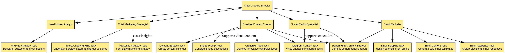

# Marketing Department Workflow

This project represents a marketing department's workflow, focusing on the key roles and tasks within the team. The department is structured to ensure a smooth and efficient flow of work from strategy development to content creation and campaign management.

## Project Overview

The project outlines a hierarchical workflow that includes the roles of various agents within the marketing department, including their tasks and the dependencies between them. The Chief Creative Director oversees the entire process, coordinating the efforts of various specialists and ensuring the final output aligns with the marketing strategy.

### Roles and Responsibilities:

- **Chief Creative Director** (Manager Agent): Oversees the entire department, ensuring all tasks align with the overall strategy and vision.
- **Lead Market Analyst**: Focuses on researching customers and competitors to guide marketing strategies.
- **Chief Marketing Strategist**: Develops the overall marketing strategy, providing direction for campaigns and tasks.
- **Creative Content Creator**: Creates innovative campaign ideas and final content drafts for marketing efforts.
- **Email Marketer**: Handles email-related tasks, including email scraping, content creation, and crafting responses.
- **Social Media Specialist**: Manages social media content creation, including Instagram posts and image prompts.

### Tasks:

- **Analyze Strategy Task**: Research customers and competitors to guide marketing strategy.
- **Project Understanding Task**: Understands project details and provides context for the strategy.
- **Marketing Strategy Task**: Develops a comprehensive marketing strategy.
- **Campaign Idea Task**: Creates innovative campaign ideas based on strategy.
- **Email Scraping Task**: Identifies potential client emails for outreach.
- **Email Content Task**: Generates cold email templates for outreach.
- **Email Response Task**: Crafts professional responses to emails.
- **Instagram Content Task**: Creates Instagram post copy to engage the audience.
- **Image Prompt Task**: Generates descriptions for images used in social media or campaign content.
- **Content Strategy**: Develops the final content draft, bringing together all tasks and ideas into a coherent strategy.

### Workflow Relationships:

- The **Chief Creative Director** manages the overall workflow and directs the different agents.
- The **Lead Market Analyst** provides insights through research that helps guide the marketing strategy.
- The **Chief Marketing Strategist** formulates the strategy, using inputs from the project understanding and market analysis.
- The **Creative Content Creator** generates campaign ideas and helps finalize the content strategy.
- The **Email Marketer** executes email tasks, from scraping potential client emails to crafting professional responses.
- The **Social Media Specialist** creates engaging content for Instagram and generates image descriptions to feed into the overall content strategy.

### Task Dependencies:

- Each task feeds into the next, ensuring a smooth progression from one task to another. 
- For example, the **Analyze Strategy Task** provides insights that are used in the **Marketing Strategy Task**, which in turn guides the **Campaign Idea Task**.
- Similarly, tasks like **Instagram Content Task** and **Image Prompt Task** contribute to the final content strategy, which is reviewed by the **Chief Creative Director**.

  
## Marketing Department Workflow Diagram

Here is a diagram illustrating the marketing department workflow:

## Conclusion

This project provides a comprehensive view of the marketing department's workflow, from analysis to content creation and strategy execution. By clearly defining roles, tasks, and dependencies, the workflow ensures that all agents collaborate effectively to achieve marketing goals.

